# Food Ordering Console App

## Problem Statement

### Mini Food Ordering Console App
Design a console-based mini food ordering system where:
- Admin can manage menus, discounts and delivery agents
- A customer can view a menu and place an order.
- The system calculates the total, applies a simple discount, and processes payment.
- A delivery partner is assigned to deliver the order.
- The system prints the invoice on the console.

#### Functional Scope:

- Menu Display
- Show a fixed list of food items with price.
- Order Placement - Customer selects multiple items and quantities.
- Discount - Apply a flat discount if total > ₹500.
- Payment - Choose between Cash or UPI.
- Delivery - Randomly assign one of two delivery partners.
- Invoice - Print bill with item details, discount, total, payment mode, and delivery partner.

```mermaid
classDiagram
direction TB

%% =====================================================
%% 1️⃣ USER & ROLES
%% =====================================================

class User {
    <<abstract>>
    #int id
    #String name
    #String email
    #String password
    #UserType role
    +getId() int
    +getName() String
    +getEmail() String
    +getPassword() String
    +getRole() UserType
}

class Admin {
    +Admin(id, name, email, password)
}

class Customer {
    -String phone
    -String address
    +getPhone() String
    +getAddress() String
    +setPhone(phone)
    +setAddress(address)
}

class DeliveryPartner {
    -String phone
    -DeliveryPartnerStatus status
    +getPhone() String
    +setPhone(phone)
    +getStatus() DeliveryPartnerStatus
    +setStatus(status)
}

User <|-- Admin
User <|-- Customer
User <|-- DeliveryPartner

class UserType {
    <<enumeration>>
    ADMIN
    CUSTOMER
    DELIVERY_PARTNER
}

class DeliveryPartnerStatus {
    <<enumeration>>
    ACTIVE
    INACTIVE
}

%% =====================================================
%% 2️⃣ REPOSITORIES
%% =====================================================

class UserRepository {
    <<interface>>
    +addUser(user: User)
    +removeUser(user: User)
    +getCustomers() List~Customer~
    +getUsers() List~User~
    +getAdmins() List~Admin~
    +getDeliveryPartners() List~DeliveryPartner~
    +getUserById(id: int) User
    +getUserByEmail(email: String) User
    +getCustomerById(id: int) Customer
    +getDeliveryPartnerById(id: int) DeliveryPartner
    +getAdminById(id: int) Admin
}

class InMemoryUserRepository {
    -Map~Integer, User~ users
}

UserRepository <|.. InMemoryUserRepository
InMemoryUserRepository o-- User

class CartRepository {
    <<interface>>
}

class InMemoryCartRepository {
    -Map~Integer, List~OrderItem~~ cart
    +addToCart(customerId, item)
    +removeFromCart(customerId, item)
    +clearCart(customerId)
    +getCart(customerId) List~OrderItem~
}

CartRepository <|.. InMemoryCartRepository
InMemoryCartRepository o-- OrderItem

class OrderRepository {
    <<interface>>
}

class InMemoryOrderRepository {
    -List~Order~ orders
    +addOrder(order)
    +removeOrder(order)
    +getAllOrders() List~Order~
}

OrderRepository <|.. InMemoryOrderRepository
InMemoryOrderRepository o-- Order

%% =====================================================
%% 3️⃣ AUTH & SESSION
%% =====================================================

class SessionManager {
    -User currentUser
    +login(user: User)
    +logout()
    +getCurrentCustomer() User
    +isLoggedIn() boolean
    +getSessionManager() SessionManager
}

SessionManager --> User

class AuthService {
    -UserRepository userRepository
    +register(user: User)
    +login(email, password) User
}

AuthService --> UserRepository

class AuthController {
    -UserRepository userRepository
    -AuthService authService
    -SessionManager sessionManager
    +registerUser(role: UserType) User
    +loginUser() User
}

AuthController --> UserRepository
AuthController --> AuthService
AuthController --> SessionManager

%% =====================================================
%% 4️⃣ MENU (COMPOSITE)
%% =====================================================

class Menu {
    <<interface>>
    +add(item: Menu)
    +remove(item: Menu)
    +getMenu() List~Menu~
    +render(indent: String)
}

class FoodItem {
    -int id
    -String name
    -double price
    +getId() int
    +getName() String
    +getPrice() double
}

class MenuCategory {
    -int id
    -String category
    -List~Menu~ items
    +getId() int
    +getCategory() String
}

Menu <|.. FoodItem
Menu <|.. MenuCategory
MenuCategory o-- Menu

class MenuService {
    -Menu root
    +addCategory(parentId, id, name)
    +addFoodItem(categoryId, id, name, price)
    +displayMenu()
    +findCategoryByName(parentId, name) MenuCategory
    +findFoodItemByName(name) FoodItem
    +findFoodItem(id) FoodItem
    +getMenu() Menu
    +getFoodItems() List~FoodItem~
    +getCategory() List~MenuCategory~
}

MenuService --> Menu

%% =====================================================
%% 5️⃣ CART & ORDER ITEMS
%% =====================================================

class OrderItem {
    -int id
    -FoodItem foodItem
    -int quantity
    -double price
}

OrderItem --> FoodItem

class CartService {
    -InMemoryCartRepository cartRepository
    -CustomerService customerService
    +addOrderItemToCart(customerId, item)
    +getOrderItemFromCart(customerId, itemId) OrderItem
    +removeOrderItemFromCart(customerId, item)
    +updateOrderItemQuantity(customerId, item)
    +getCart(customerId) List~OrderItem~
    +clearCustomerCart(customerId)
}

CartService --> InMemoryCartRepository

%% =====================================================
%% 6️⃣ PAYMENT (FACTORY)
%% =====================================================

class Payment {
    <<interface>>
    +pay(amount: double)
}

class CashPayment {
    +pay(amount: double)
}

class UPIPayment {
    +pay(amount: double)
}

Payment <|.. CashPayment
Payment <|.. UPIPayment

class PaymentMode {
    <<enumeration>>
    UPI
    CASH
}

class PaymentFactory {
    +getPaymentMethod(mode: PaymentMode) Payment
}

PaymentFactory --> Payment

%% =====================================================
%% 7️⃣ DISCOUNT
%% =====================================================

class Discount {
    <<interface>>
    +getDiscount() double
    +setDiscount(rate: double)
}

class FlatDiscount {
    -double discount
    -double flatDiscountOn
    +getInstance() FlatDiscount
    +getDiscount() double
    +setDiscount(rate: double)
    +getFlatDiscountOn() double
    +setFlatDiscountOn(amount: double)
}

Discount <|.. FlatDiscount

class DiscountService {
    +applyFlatDiscount(amount: double) double
}

%% =====================================================
%% 8️⃣ ORDER
%% =====================================================

class Order {
    -int id
    -User customer
    -List~OrderItem~ orderItems
    -double total
    -double discountRate
    -PaymentMode mode
    -DeliveryPartner deliveryPartner
    -double finalAmount
}

Order o-- OrderItem
Order --> User
Order --> DeliveryPartner
Order --> PaymentMode

%% =====================================================
%% 9️⃣ SERVICES
%% =====================================================

class CustomerService {
    -UserRepository userRepository
    +findCustomerById(id) User
    +findCustomerByEmail(email) User
}

CustomerService --> UserRepository

class AdminService {
    -UserRepository userRepository
    +getAdminByEmail(email) Admin
}

AdminService --> UserRepository

class DeliveryPartnerService {
    -UserRepository userRepository
    -InMemoryOrderRepository orderRepository
    +getDeliveryPartners() List~DeliveryPartner~
    +addDeliveryPartner(partner)
    +checkDeliveryPartnerAvailable() boolean
    +getDeliveryPartnerById(id) DeliveryPartner
    +getDeliveryPartnerByEmail(email) DeliveryPartner
    +assignDeliveryPartnerRandomly() DeliveryPartner
    +getOrdersByDeliveryPartner(id) List~Order~
    +changeDeliveryPartnerStatus(partner, status)
}

DeliveryPartnerService --> UserRepository
DeliveryPartnerService --> InMemoryOrderRepository

class OrderService {
    -DeliveryPartnerService deliveryPartnerService
    -InMemoryOrderRepository orderRepository
    -InMemoryCartRepository cartRepository
    -DiscountService discountService
    +placeOrder(customer, mode, cart) Order
    +getOrdersByCustomer(customer) List~Order~
    +assignDeliveryPartner(order) DeliveryPartner
}

OrderService --> DeliveryPartnerService
OrderService --> InMemoryOrderRepository
OrderService --> InMemoryCartRepository
OrderService --> DiscountService

%% =====================================================
%% 🔟 CONTROLLERS
%% =====================================================

class AdminController {
    -MenuService menuService
    -DeliveryPartnerService deliveryPartnerService
    +displayOptions()
}

AdminController --> MenuService
AdminController --> DeliveryPartnerService

class CustomerController {
    -CustomerService customerService
    -MenuService menuService
    -OrderService orderService
    -CartService cartService
    -SessionManager sessionManager
    -DeliveryPartnerService deliveryPartnerService
    +displayOptions()
}

CustomerController --> CustomerService
CustomerController --> MenuService
CustomerController --> OrderService
CustomerController --> CartService
CustomerController --> SessionManager
CustomerController --> DeliveryPartnerService

class DeliveryPartnerController {
    -DeliveryPartnerService deliveryPartnerService
    -SessionManager sessionManager
    +getDeliveryPartnersOrder()
}

DeliveryPartnerController --> DeliveryPartnerService
DeliveryPartnerController --> SessionManager

%% =====================================================
%% 1️⃣1️⃣ MAIN
%% =====================================================

class Main {
    -AdminController adminController
    -CustomerController customerController
    -DeliveryPartnerController deliveryPartnerController
    -AuthController authController
    +main(args: String[])
}

Main --> AuthController
Main --> AdminController
Main --> CustomerController
Main --> DeliveryPartnerController
```

